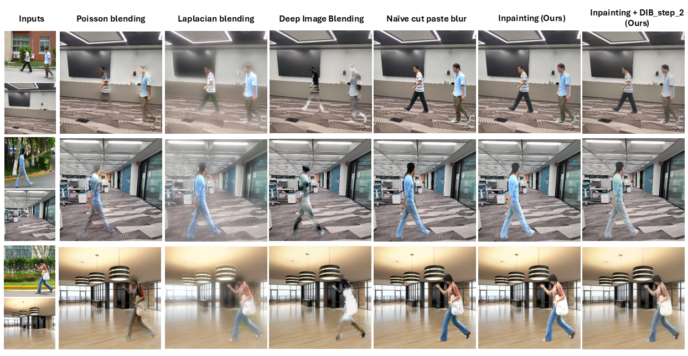

# Seamless-Human-Background-Integration

### Generating Augmented Datasets
We have the following blending techniques available - 
1) "cutpaste" - simply cuts the human from the outdoor image and pastes it onto the indoor image (with a blur around the borders)
2) "laplacian" - uses the famous Laplacian blending technique (involves Gaussian and Laplacian pyramid generation)
3) "poisson" - uses the famous Poisson blending technique (OpenCV implementation cv2.seamlessClone()
4) "inpaint" - our proposed technique (please refer to our paper for details on this technique)

Steps to blend a human from an outdoor image into an indoor setting:
1) Open the colab notebook here 
2) Clone our repository in colab workspace
3) Put all your indoor background images in the "back" folder. If you don't have any indoor images of your own you can use ours [here](https://drive.google.com/drive/folders/1zX4OMQAFEivr-3Po37BnGDsEGBHGJ8a2?usp=sharing).
4) Put all your outdoor images containing humans in the "front" folder. If you don't have any outdoor images of your own you can use ours [here](https://drive.google.com/drive/folders/1zX4OMQAFEivr-3Po37BnGDsEGBHGJ8a2?usp=sharing).
5) Go to the section of the notebook that says "Generate all datasets" and paste the following code into the cell below it and run the cell:
      - If you want to generate datasets with all techniques - generate_dataset()
      - If you want to generate a simple cut-paste dataset = generate_dataset(blending="cutpaste")
      - If you want to generate a laplacian blend dataset = generate_dataset(blending="laplacian")
      - If you want to generate a poisson blend dataset = generate_dataset(blending="poisson")
      - If you want to generate a dataset with our technique = generate_dataset(blending="inpaint") Note: This is without deep image blend step 2
6) Running the cell under it to download the zipped file for the generated datasets and bounding boxes. The zipped file will contain the blended images and a copy of the blended images with bounding boxes (incase they need to be used as object detection datasets).
We already have the downloaded datasets in drive [here](https://drive.google.com/drive/folders/1kM5gjWWm6CEaO1gbnBYnvurmNirJ-k0U?usp=sharing)
   
<b>Note</b>: If you use local Jupyter Notebook you may have to slightly change calls to cv2.imshow().

### Traning models for object detection
Steps to blend a human from an outdoor image into an indoor setting:
1) Clone our repository
2) Create conda environment using the requirements.txt file
3) Add the zip files from previous steps to our repository
4) Run prepare_for_training.py file
5) If you want deep image blend step 2 images, run deep_image_blending_step2.py file
6) This will create a datasets folder and have all the datasets ready for training and evaluation. We have already done this step and you can access the zip file [here](https://drive.google.com/file/d/1x_6BSGc4Ssgbqn-2WK0d-yYCM_A0t8X2/view?usp=drive_link). You can extract and place it in the cloned repository
7) Use the train.ipynb notebook to train the models.
8) All the models will be saved in the models folder. We have already trained and saved the best models [here](https://drive.google.com/drive/folders/1c4eXjVIyI_u5cOO8SFdxkXewreCASB1j?usp=sharing)

